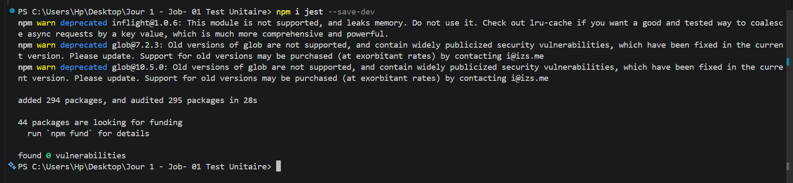
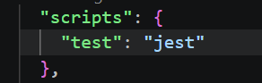
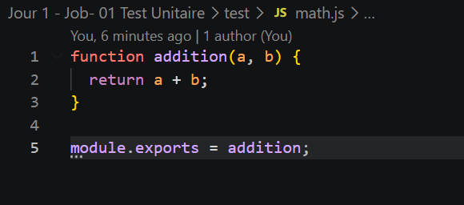
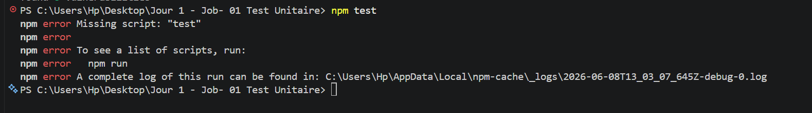
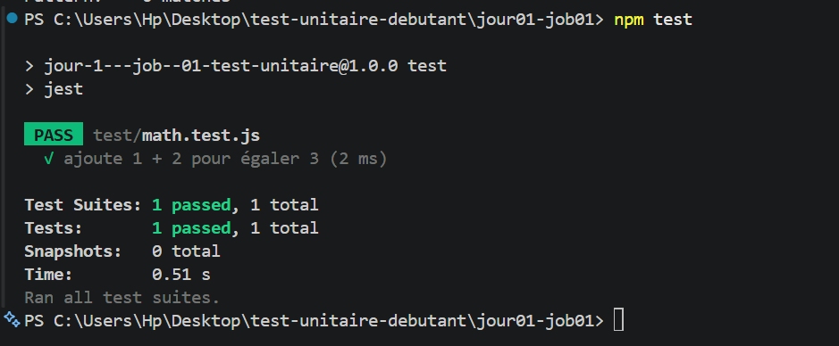
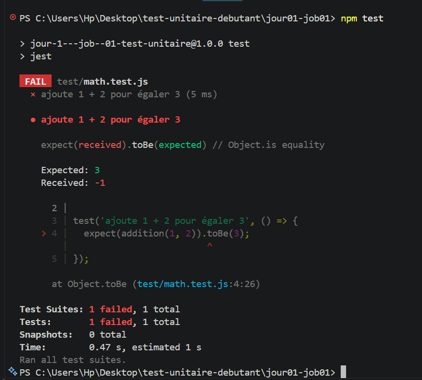
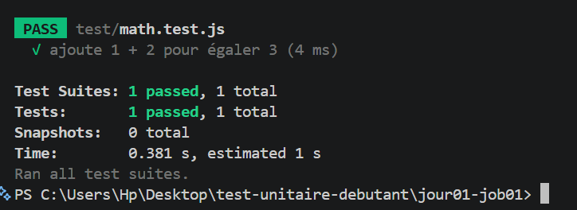

# Projet : Tests Unitaires Débutant

Ce projet a pour objectif de faire les premiers pas dans les tests unitaires. Il montre comment créer un petit projet JavaScript avec Node.js, y intégrer Jest, et rédiger des tests pour vérifier le bon fonctionnement du code.

---

## Étape 1 : Initialisation du projet Node.js
Création du dossier de travail et initialisation d'un projet Node.js avec la commande `npm init -y`.

---

## Étape 2 : Installation et configuration de Jest
Installation de l'outil de test avec la commande `npm install --save-dev jest`. Ensuite, le fichier `package.json` a été modifié pour utiliser Jest lors de l'appel de la commande de test.

    

---

## Étape 3 : Configuration du fichier package.json
Modification du fichier `package.json` pour remplacer le script de test par défaut par Jest. 

---

## Étape 4 : Création de la fonction et du fichier de test
Création du fichier `math.js` contenant une fonction simple d'addition, et du fichier `math.test.js` contenant les instructions de test pour vérifier cette fonction.

---

## Étape 5 : Première exécution et erreur rencontrée
Lors du premier lancement de la commande de test, une erreur est apparue car le script était introuvable ou le fichier mal nommé. 

---
## Étape 6 : Exécution du test unitaire (Succès)
Lancement du test avec la commande `npm test`. Le test vérifie que la fonction ajoute bien 1 + 2 pour égaler 3. Le résultat est un succès.

---

## Étape 7 : Test en échec (Modification volontaire)
Modification volontaire du code (remplacement de l'addition par une soustraction) pour vérifier que l'outil détecte bien l'erreur. Le test échoue comme prévu.

*

---

## Étape  : Correction de l'erreur
Correction du code de la fonction et relance du test unitaire. Le test passe à nouveau avec succès, confirmant que la fonction est réparée et valide.

