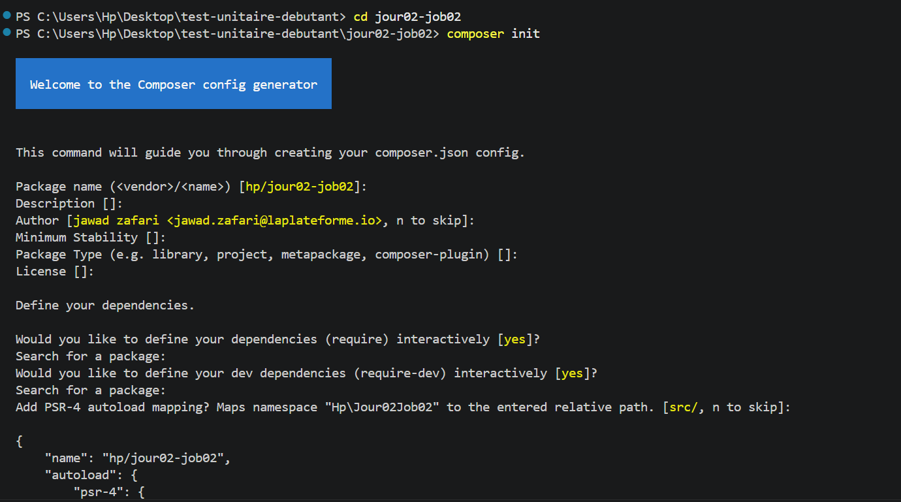
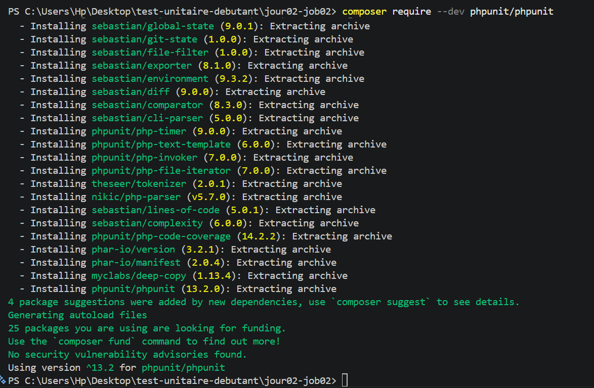
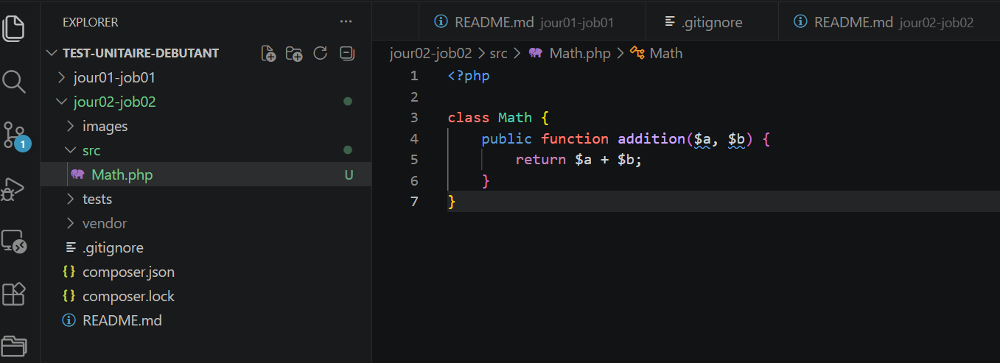
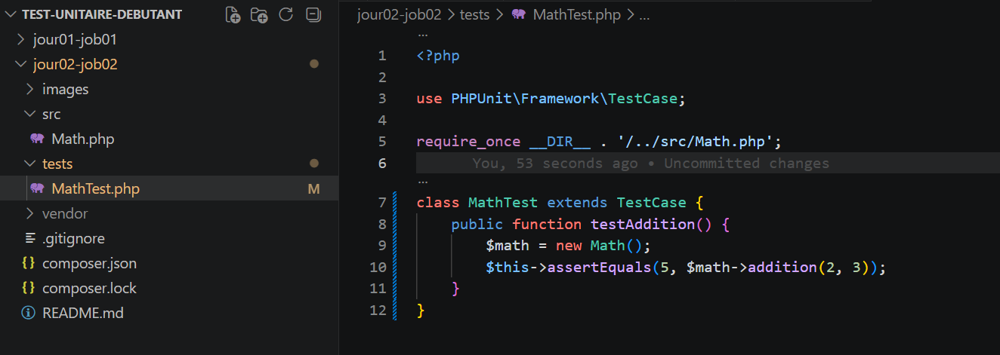
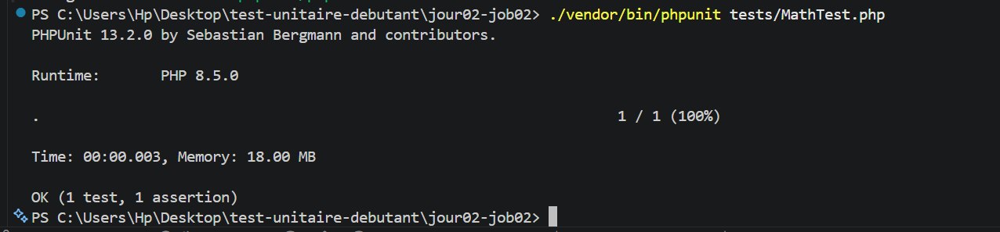
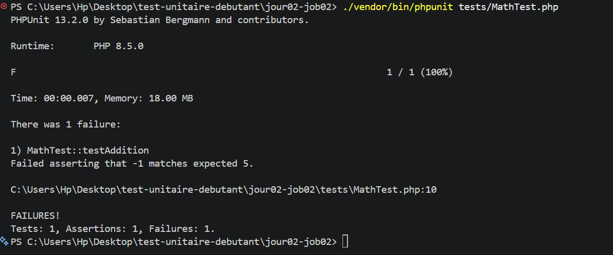
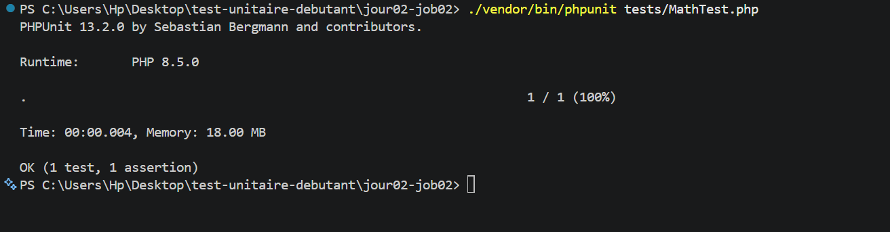

# Projet : Tests Unitaires avec PHPUnit

Ce projet a pour objectif de découvrir PHPUnit, l'outil le plus utilisé pour les tests unitaires en PHP. Il montre comment initialiser un projet avec Composer, configurer la structure des dossiers src et tests, et rédiger un test unitaire pour vérifier le bon fonctionnement du code.

---

## Étape 1 : Initialisation du projet avec Composer
Création du dossier de travail et initialisation du projet à l'aide de la commande `composer init` pour générer le fichier de configuration initial.

---

## Étape 2 : Installation de PHPUnit
Installation de l'outil PHPUnit en tant que dépendance de développement à l'aide de la commande `composer require --dev phpunit/phpunit`.

---

## Étape 3 : Structure des dossiers et code source
Configuration de la structure du projet avec la création du dossier `src` pour les fichiers de code et du dossier `tests` pour les tests. Écriture de la classe `Math.php` contenant la méthode d'addition.

---

## Étape 4 : Création du fichier de test
Création du fichier `MathTest.php` dans le dossier des tests pour définir le scénario de test et vérifier la méthode d'addition avec l'assertion correspondante.

---

## Étape 5 : Exécution du test unitaire (Succès)
Lancement de PHPUnit pour exécuter le test. Le résultat affiche un message de succès (OK), confirmant que la méthode fonctionne parfaitement.

---

## Étape 6 : Test en échec (Modification volontaire)
Modification volontaire du code dans la classe Math (remplacement de l'addition par une soustraction) pour faire échouer le test et analyser le rapport d'erreur de PHPUnit.

---

## Étape 7 : Correction et validation finale
Restauration du code correct pour la méthode d'addition et nouvelle exécution du test. Le système affiche à nouveau un résultat positif (OK).

